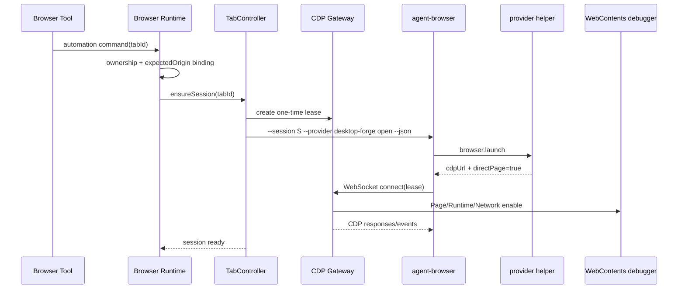

# desktop-forge agent-browser 最终目标架构

## 0. 文档状态

| 项目 | 值 |
| --- | --- |
| 状态 | Final Target / 实施与验收基线 |
| 开发基线 | Git 分支 `2.0` |
| 基线提交 | `fc12cfff8ab8e04385fce486c0b7fe3fc2e79799` |
| 决策日期 | 2026-07-28 |
| 主要范围 | `packages/desktop-forge`、`packages/browser-protocol`、`packages/opencode/src/browser`、`packages/opencode/src/tool/browser/` |
| 上游 | [vercel-labs/agent-browser](https://github.com/vercel-labs/agent-browser) |

本文档是 desktop-forge 内置浏览器迁移到 agent-browser 的最新目标定义和唯一实施基线。

以下文档保留为历史资料，但其中与本文冲突的自动化引擎、Playwright、只读 evaluate、等待机制和目录结构不再作为目标：

- `packages/desktop-forge/BROWSER_ARCHITECTURE.md`
- `packages/desktop-forge/BROWSER_SKILL_MIGRATION_PLAN.md`

本文只描述最终交付状态。实施进度、临时开关和逐阶段提交记录不写入本文。

## 1. 最终结论

desktop-forge 保留 Electron `WebContentsView` 作为唯一真实浏览器页面和用户可见界面。

agent-browser 不启动 Chrome，不创建 headless/headed 浏览器，不使用 screencast、stream 或远程页面镜像。它通过一个 desktop-forge 内部 Gateway 连接某一个 `WebContentsView` tab 的 `webContents.debugger`。

最终链路：

```text
OpenCode capability-scoped Browser Tools
→ Browser Runtime / Security Gate
→ AgentBrowserTabController
→ agent-browser CLI / daemon
→ desktop-forge browser.provider
→ CdpTabGateway
→ 指定 tab 的 webContents.debugger
→ 当前 WebContentsView 中的真实页面
```

必须满足：

- 不开启 Electron/Chromium 全局 CDP。
- 不设置 `--remote-debugging-port`。
- 不提供 `/json/version`、`/json/list` 或 Target 枚举接口。
- 一个 Gateway lease 只能访问一个明确授权的 tab。
- agent-browser 使用 direct-page provider 模式，跳过浏览器级 Target 发现。
- 页面始终直接显示在 `WebContentsView`，不使用 agent-browser `stream enable`。
- Electron 继续拥有 tab 生命周期、用户会话、下载、弹窗、文件选择、导航错误和 UI 状态。
- agent-browser 成为语义快照、locator、页面读取和交互动作的自动化执行器。
- 当前自研 Playwright injected runtime、locator runtime 和 detached read-only evaluate 最终删除。

## 2. 分支和代码基线

### 2.1 基线选择

所有实现从当前 `2.0` 分支开始。

推荐开发分支：

```text
2.0
└── codex/agent-browser-gateway
```

不以以下分支为基线：

- `browser-version-1`
- `browser-version-2`

原因：

- 两者都是 WIP 保存提交。
- 两者继续扩展即将被 agent-browser 替换的自研 Playwright/evaluate 体系。
- `browser-version-2` 相对当前分支涉及 36 个文件、约 `+5727/-1045`，迁移冲突面过大。
- 两者没有修改当前 locator 的核心轮询逻辑，不能直接解决 `input.s_ipt` 和 `.quickdelete` 超时。
- `browser-version-2` 还会覆盖当前分支已经修复的导航 generation 行为。

### 2.2 可参考但不整体合并的内容

允许从 `browser-version-1/2` 人工移植设计或测试思想：

- origin、上传、下载和 raw CDP 的分层授权。
- OOPIF `sessionId` 路由测试。
- CDP navigation/load event 测试。
- tab 关闭、取消和 timeout 测试。
- transport token 不可见测试。
- 浏览器内容不可信和高风险动作确认文档。

禁止直接 cherry-pick `fe05b4fab` 或 `6f3b24ea6`。

## 3. 目标和非目标

### 3.1 目标

1. 保留当前桌面端真实浏览体验和持久登录状态。
2. 用 agent-browser 替换自研 Playwright locator、snapshot 和只读 evaluate 执行层。
3. 通过单 tab Gateway 隔离 CDP 权限。
4. 让模型以最新 snapshot ref 或语义 locator 操作页面，减少猜测 CSS。
5. 为缺失、歧义、不可操作、过期 ref 和超时提供可区分的错误。
6. 使用 agent-browser 的具名读取能力解决 live DOM 布局和 HTML 查询。
7. 保留现有 Browser Runtime、typed protocol、ownership、permission 和事件模型。
8. 支持 macOS、Windows 和 Linux 打包环境。
9. 固定 agent-browser 版本和二进制校验值，确保升级可控。
10. 最终删除不再使用的 Playwright、happy-dom 和自研 evaluate 代码。

### 3.2 非目标

- 不把 Chrome 或 Chrome for Testing 嵌入 desktop-forge。
- 不复用用户系统 Chrome。
- 不开放浏览器级 CDP。
- 不让 agent-browser 创建、枚举、切换或关闭 desktop-forge 之外的 Target。
- 不通过视频帧、截图流或远程桌面展示页面。
- 不把 Gateway URL、lease、token 或 agent-browser socket 暴露给 renderer、模型或 Skill。
- 不让 agent-browser 管理 Electron partition、Cookie profile 或登录态。
- 不开放默认可修改页面的任意 JavaScript evaluate。
- 不同时长期维护旧 Playwright runtime 和新 agent-browser runtime。
- 不把 `browser-version-1/2` 的 Browser JavaScript VM 作为本次迁移前置条件。
- 不改变 BrowserPanel 的布局、动画和现有标签页视觉行为。

## 4. 核心设计原则

### 4.1 WebContentsView 是浏览器本体

`WebContentsView` 不是 agent-browser 的预览窗口，而是实际页面。

用户看到的渲染、焦点、输入、滚动、Cookie、缓存、localStorage、IndexedDB、Service Worker 和下载会话都属于 Electron 当前 tab。

agent-browser 只作为自动化客户端附着到这个页面。

### 4.2 Gateway 是单页传输层

Gateway 不实现 Browser Backend，不模拟 Chrome browser endpoint，也不维护第二份页面状态。

Gateway 只做：

- 验证一次性 lease。
- 将标准 CDP request 转换为 `webContents.debugger.sendCommand()`。
- 将 debugger event 转换为标准 CDP event。
- 绑定并验证子 `sessionId`。
- 拒绝越过当前 tab 边界的 CDP method。
- 在 tab、lease 或 debugger 生命周期结束时断开连接。

### 4.3 agent-browser 使用 direct-page provider

普通 `--cdp` 连接可能执行浏览器级 `Target.getTargets`、`Target.attachToTarget` 等发现流程，不符合本项目边界。

desktop-forge 必须通过 agent-browser `browser.provider` 插件返回：

```json
{
  "protocol": "agent-browser.plugin.v1",
  "success": true,
  "browser": {
    "cdpUrl": "ws://127.0.0.1:PORT/cdp/OPAQUE_LEASE",
    "directPage": true
  }
}
```

direct-page 模式将 WebSocket 直接视为 page session，并跳过浏览器级 Target 发现。实现时以固定版本中的以下上游源码为契约依据：

- [agent-browser browser.rs](https://github.com/vercel-labs/agent-browser/blob/main/cli/src/native/browser.rs)
- [agent-browser providers.rs](https://github.com/vercel-labs/agent-browser/blob/main/cli/src/native/providers.rs)
- [agent-browser Plugin System](https://github.com/vercel-labs/agent-browser#plugin-system)

### 4.4 Electron 继续拥有产品生命周期

以下能力不得迁移给 agent-browser：

- 创建、激活、显示、隐藏和关闭 `WebContentsView`。
- tab ownership、claim、finalize、deliverable 和 handoff。
- `persist:desktop-forge-browser` partition。
- 地址栏、历史、favicon 和错误页。
- 下载记录和文件落盘授权。
- 文件选择器和本地文件授权。
- JavaScript dialog 的产品状态和 UI。
- 浏览器面板 viewport 和可见性。
- Browser Runtime 状态和事件发布。

### 4.5 一个 tab 一个自动化会话

每个被自动化控制的 tab 对应一个独立 agent-browser session。

不同 tab 之间不得共享：

- snapshot refs。
- active page。
- Gateway lease。
- child CDP session 集合。
- command queue。
- timeout 和取消状态。

## 5. 总体架构

```mermaid
flowchart LR
    Model["模型 / Agent"] --> Tool["OpenCode browser Tool"]
    Skill["可信 Browser Skill"] --> Capability["Authorized Browser Capability"]
    Tool --> Capability
    Capability --> Client["Browser Client"]
    Client --> Transport["Authenticated HTTP Transport"]
    Renderer["BrowserPanel"] --> IPC["Renderer IPC"]
    Transport --> Dispatcher["BrowserCommandDispatcher"]
    IPC --> Dispatcher
    Dispatcher --> Security["BrowserSecurityGate"]
    Security --> Backend["EmbeddedBrowserBackend"]

    Backend --> Tabs["EmbeddedTabStore"]
    Backend --> Product["Navigation / Dialog / Download / File Chooser / CUA"]
    Backend --> Adapter["AgentBrowserCommandAdapter"]
    Adapter --> Controller["AgentBrowserTabController"]
    Controller --> Process["agent-browser CLI / daemon"]
    Process --> Provider["desktop-forge browser.provider"]
    Provider --> Gateway["CdpTabGateway"]
    Gateway --> Debugger["TabDebuggerTransport"]
    Debugger --> View["WebContentsView webContents.debugger"]

    Tabs --> View
    Product --> View
    View --> Events["BrowserEventStore"]
    Events --> Renderer
    Events --> Transport
```



### 5.1 控制面

控制面负责：

- typed Browser command。
- origin 和 ownership 授权。
- tab 与 agent-browser session 映射。
- 进程生命周期。
- command timeout、取消和错误映射。
- 结果规范化。

控制面不直接暴露 CDP WebSocket。

### 5.2 数据面

数据面仅包含：

```text
agent-browser daemon
↔ loopback WebSocket
↔ CdpTabGateway
↔ webContents.debugger
```

数据面承载 CDP JSON request、response 和 event，不承载页面视频流。

## 6. 现有组件的保留范围

### 6.1 原样保留或小幅调整

| 当前组件 | 最终职责 |
| --- | --- |
| `browser/runtime.ts` | Browser Runtime 入口、Registry、Dispatcher 和事件接线 |
| `browser/command-dispatcher.ts` | typed command 分发和统一错误返回 |
| `browser/security.ts` | request identity、tab ownership、origin、文件和坐标安全 |
| `browser/transport-server.ts` | OpenCode 到 Electron 的认证 HTTP transport |
| `browser/event-store.ts` | Runtime 状态事件 |
| `embedded/tab-store.ts` | `WebContentsView` 和 tab 生命周期 |
| `embedded/navigation.ts` | 导航、历史、favicon、错误页和 generation |
| `embedded/dialogs.ts` | JavaScript dialog 产品行为 |
| `embedded/downloads.ts` | 下载记录和授权 |
| `embedded/file-chooser.ts` | 文件选择和本地路径验证 |
| `embedded/permissions.ts` | Electron 页面权限 |
| `embedded/clipboard.ts` | 受控剪贴板能力 |
| `automation/input.ts` | 坐标 CUA 和产品级输入 fallback |
| `automation/screenshot.ts` | Browser Tool 截图和资产返回 |
| `automation/cdp.ts` | 收敛为 debugger transport 公共工具 |

### 6.2 最终替换或删除

| 当前组件 | 最终处理 |
| --- | --- |
| `automation/playwright-runtime.ts` | 被 agent-browser adapter 替换后删除 |
| `automation/locator.ts` | 被 agent-browser locator/ref 命令替换后删除 |
| `automation/readonly-evaluate.ts` | 被具名 live-page 读取命令替换后删除 |
| `automation/playwright-internals.d.ts` | 删除 |
| `automation/ws-bufferutil.ts` | 若仅服务 Playwright 打包则删除 |
| `automation/ws-utf8-validate.ts` | 若仅服务 Playwright 打包则删除 |
| `opencode-playwright-injected-source` 使用 | 删除 |
| `opencode-playwright-locator-utils` 使用 | 删除 |
| `playwright-core` dependency | 最终删除 |
| `happy-dom`、`acorn` | 最终删除 |
| Vite 中 Playwright generated source alias | 最终删除 |

### 6.3 可继续保留的 fallback

DOM CUA 和坐标 CUA 可以继续保留，但不得作为正常语义 locator 的第一选择。

优先级：

```text
agent-browser snapshot/ref 或语义 locator
→ agent-browser 具名页面读取
→ DOM CUA
→ 坐标 CUA
```

## 7. 新增组件

目标目录：

```text
packages/desktop-forge/src/electron/browser/
└── agent-browser/
    ├── controller.ts
    ├── command-adapter.ts
    ├── process-manager.ts
    ├── gateway.ts
    ├── debugger-transport.ts
    ├── provider-contract.ts
    ├── session-store.ts
    ├── errors.ts
    └── types.ts

packages/desktop-forge/script/
└── agent-browser-provider.ts

packages/desktop-forge/resources/
└── agent-browser/
    └── PLATFORM-ARCH/
        ├── agent-browser
        └── desktop-forge-agent-browser-provider
```

实现时遵循仓库风格，只有被多个模块复用的职责才拆文件；若 provider helper 由构建脚本生成，可只保留源文件和构建入口。

### 7.1 `TabDebuggerTransport`

`TabDebuggerTransport` 是每个 tab 唯一的 debugger owner。

职责：

- 保证 `webContents.debugger.attach("1.3")` 只执行一次。
- 为现有 Network/Page 监听和 Gateway 共享同一个 debugger attachment。
- 转发 `sendCommand(method, params, sessionId?)`。
- 发布 debugger message 和 detach。
- 记录当前 tab 已观察到的 child `sessionId`。
- 在 tab destroyed 时统一释放。

Gateway 不得自行重复 attach 或 detach。

### 7.2 `CdpTabGateway`

应用进程只启动一个 loopback WebSocket listener。

Gateway 不按 tab 启动多个 TCP server，而是用 opaque lease 将每个 WebSocket 静态绑定到一个 tab。

职责：

- 创建、消费、撤销和过期 lease。
- 验证连接来源和 token。
- 验证 CDP message schema。
- 转发 request 并产生 response。
- 转发 debugger event。
- 执行 method/session policy。
- 执行消息大小、并发和 timeout 限制。
- 输出脱敏结构化诊断事件。

### 7.3 `AgentBrowserProcessManager`

职责：

- 解析当前平台和架构的 agent-browser binary。
- 校验可执行文件存在和版本匹配。
- 使用参数数组直接 spawn，禁止通过 shell 拼接命令。
- 为子进程设置 scoped environment，不修改全局 `process.env`。
- 隔离 socket/config/cache 目录。
- 收集 stdout JSON 和受限 stderr。
- 响应 `AbortSignal`。
- 在 app shutdown、tab close 和 idle timeout 时清理 session。
- 限制最大并发 session 数。

### 7.4 `AgentBrowserTabController`

职责：

- 一个 `tabId` 对应一个 session record。
- 首次自动化命令时懒创建 Gateway lease 和 agent-browser session。
- 使用 provider 完成 direct-page 连接。
- 对同一 tab 的命令串行化，保证 snapshot ref 顺序。
- 调用 agent-browser `--json` 命令。
- 规范化 stdout、exit code 和 timeout。
- 维护最新 snapshot 元数据。
- 在可恢复连接错误后最多重连一次。
- 将 agent-browser 错误映射为 Browser Protocol typed error。

### 7.5 `AgentBrowserCommandAdapter`

职责：

- 将 Browser Protocol 中性命令转换成 agent-browser CLI 命令。
- 验证 command 是否允许 agent-browser 执行。
- 转换 snapshot、ref、文本、box、HTML、状态和 action 结果。
- 不把 CLI 文本错误直接返回给模型。
- 不把 Gateway URL、session name 或本地进程信息放入结果。

### 7.6 `desktop-forge browser.provider`

provider 是受信任的本地辅助进程。

职责：

- 实现 `agent-browser.plugin.v1` stdio JSON 协议。
- 接收 agent-browser 的 browser launch 请求。
- 从仅本次 spawn 的环境中读取一次性 Gateway URL。
- 返回 `cdpUrl` 和 `directPage: true`。
- 不自行打开浏览器，不访问 renderer，不保存 token。
- 请求结束后立即退出。

## 8. Gateway 详细契约

### 8.1 监听边界

Gateway 必须：

- 绑定 `127.0.0.1`，不能绑定 `0.0.0.0`。
- IPv6 开启时只允许 `::1`。
- 使用系统分配的随机端口。
- 不提供普通 HTTP 页面。
- 不提供 CDP discovery endpoint。
- 不提供稳定 tab ID 路径。

示例：

```text
ws://127.0.0.1:43127/cdp/5c6a...高熵随机lease...
```

路径中的 opaque lease 同时承担路由和一次性能力凭证，不包含真实 `tabId`。

### 8.2 Lease 数据

内部 lease 至少包含：

```ts
type CdpTabLease = {
  id: string
  tabId: string
  ownerSessionId: string
  tabGeneration: number
  createdAt: number
  expiresAt: number
  connectedAt?: number
  revokedAt?: number
}
```

约束：

- lease 使用密码学安全随机值。
- 未连接 lease 默认 30 秒过期。
- lease 首次成功连接后不可被第二个 socket 使用。
- tab close、ownership release、session finalize、app shutdown 时立即撤销。
- 不在日志中记录完整 lease。

### 8.3 CDP request

接受：

```json
{
  "id": 1,
  "method": "Runtime.evaluate",
  "params": {},
  "sessionId": "optional-child-session"
}
```

校验：

- `id` 必须是有限整数。
- `method` 必须是非空字符串。
- `params` 必须是对象或省略。
- 空字符串 `sessionId` 规范化为根 session。
- 非空 `sessionId` 必须已由同一个 tab 的 debugger event 观察到。
- 单个连接最多 256 个 pending request。
- 单条消息最大 16 MiB。

### 8.4 CDP response

成功：

```json
{
  "id": 1,
  "result": {}
}
```

失败：

```json
{
  "id": 1,
  "error": {
    "code": -32000,
    "message": "Target is no longer available"
  }
}
```

Gateway 可以乱序返回并发 request 的 response，但不得复用或修改 agent-browser 的 request `id`。

### 8.5 CDP event

Electron debugger：

```ts
debugger.on("message", (_event, method, params, sessionId) => {})
```

Gateway 输出：

```json
{
  "method": "Page.loadEventFired",
  "params": {},
  "sessionId": "optional-child-session"
}
```

Electron 官方接口允许 `sendCommand` 和 message event 携带 `sessionId`：

- [Electron Debugger API](https://www.electronjs.org/docs/latest/api/debugger/)

### 8.6 CDP method policy

默认允许 agent-browser page automation 所需的页面级 domain：

- `Accessibility`
- `CSS`
- `DOM`
- `DOMDebugger`
- `Emulation`
- `Fetch`
- `Input`
- `Log`
- `Network`
- `Overlay`
- `Page`
- `Performance`
- `Runtime`
- `Storage`

受限允许：

- `Target.setAutoAttach`：仅用于当前 page 的 OOPIF。
- `Target.detachFromTarget`：仅限当前 tab 已观察到的 child session。
- `Browser.getVersion`：优先转发；Electron 不支持时由 Gateway 返回最小兼容结果。

默认拒绝：

- `Browser.close`
- `Target.createTarget`
- `Target.closeTarget`
- `Target.activateTarget`
- `Target.getTargets`
- `Target.getBrowserContexts`
- `Target.createBrowserContext`
- `Target.disposeBrowserContext`
- `SystemInfo.*`
- 任何无法证明只作用于当前 tab 的 Browser/Target method

method policy 必须由 contract test 覆盖。升级 agent-browser 时，如果需要新增 method，必须先更新 allowlist、风险说明和测试。

### 8.7 OOPIF

跨域 iframe 使用 Electron debugger 的 child `sessionId`。

要求：

- Gateway 记录 `Target.attachedToTarget` 及带 `sessionId` 的 debugger event。
- child session 必须归属于当前 tab。
- agent-browser 发往 child session 的命令通过 `sendCommand(method, params, sessionId)` 转发。
- tab 或 child target 销毁后立即使对应 sessionId 失效。
- 不允许拿一个 tab 的 child sessionId 控制另一个 tab。

## 9. agent-browser 连接和命令生命周期

### 9.1 首次连接



`open` 不携带 URL。它只用于让 agent-browser 连接当前已存在的 page。

固定的 agent-browser `0.33.0` direct-page contract 有一个经 PoC 锁定的限制：
单独执行 `open` 会消费 one-time Gateway lease，但后续同 session 命令会再次连接并被
Gateway 正确拒绝。因此生产 Controller 由首个真实页面命令（通常是 `snapshot`）完成
provider launch 和 direct-page 连接，不额外用 `open` 预热。独立 contract test 仍执行
无 URL 的 `open`，验证它不会创建页面或导航现有 Electron tab。升级 agent-browser 后
必须重新验证该限制；只有上游能在同一连接上稳定复用时，才恢复图中的显式 `open`
预热步骤。

### 9.2 后续命令

后续命令使用同一个 session：

```text
agent-browser --session desktop-forge-TAB_HASH snapshot -i --json
agent-browser --session desktop-forge-TAB_HASH click @e12 --json
agent-browser --session desktop-forge-TAB_HASH fill @e13 "value" --json
```

实现必须使用参数数组 spawn，不生成 shell command string。

### 9.3 关闭

关闭顺序：

1. 停止接受该 tab 的新自动化命令。
2. 取消 pending controller command。
3. 请求 agent-browser 关闭外部连接 session。
4. 关闭 Gateway socket。
5. 撤销 lease。
6. 清除 snapshot metadata。
7. 保留或销毁 `WebContentsView`，由 Electron tab 生命周期决定。

agent-browser close 不得关闭 Electron tab。即使上游行为发生变化，Gateway 也必须拒绝 `Browser.close` 和越界 Target close。

### 9.4 重连

仅以下情况允许自动重连一次：

- agent-browser daemon 意外退出。
- Gateway socket 在 tab 仍存活且 ownership 未变化时断开。
- debugger 因可恢复原因重新 attach。

以下情况禁止自动重连：

- tab destroyed。
- ownership 已释放或转移。
- origin 权限失效。
- session finalize。
- app 正在退出。
- method policy 拒绝。

重连后旧 snapshot refs 全部失效。

## 10. 职责边界和命令路由

### 10.1 Electron 执行

| 能力 | 执行器 |
| --- | --- |
| tabs new/list/get/select/activate/close | Electron |
| browser show/hide/viewport | Electron |
| tab goto/back/forward/reload/stop | Electron NavigationService |
| tab state/title/url/history/favicon | Electron |
| dialog get/wait/handle | Electron |
| download wait/get/path | Electron |
| file chooser wait/setFiles | Electron |
| clipboard | Electron |
| plain screenshot/clip | Electron CDP screenshot service |
| PDF | Electron `webContents.printToPDF`（公开接口保持 agent-browser `pdf` 语义） |
| coordinate CUA | Electron input service |
| ownership/claim/finalize | Electron |
| raw dev CDP | Electron security gate + debugger transport |

### 10.2 agent-browser 执行

| 最终中性能力 | agent-browser |
| --- | --- |
| automation snapshot | `snapshot --json` |
| semantic click/fill/check/hover/text | 原生 `find` |
| ref/CSS click/double click | `click` / `dblclick` |
| fill/type/focus | `fill` / `type` / `focus` |
| press/keydown/keyup/type/insertText | 对应 keyboard command |
| hover | `hover` |
| select/check/uncheck | 对应 element action |
| scroll into view | `scrollintoview` |
| directional scroll | `scroll [direction] [amount] [--selector]` |
| drag | `drag` |
| wait selector/text/function | `wait` 的受控子集 |
| text/html/value/attribute | `get text/html/value/attr` |
| count/box/styles | `get count/box/styles` |
| visible/enabled/checked | `is visible/enabled/checked` |
| readable rendered DOM | `read` 或 snapshot 的受控结果 |
| selector/annotated screenshot | `screenshot [selector] [path] [--annotate]` |

### 10.3 不暴露的 agent-browser 能力

以下命令不对 Browser Tool 暴露：

- `tab new`
- `tab close`
- `window new`
- `connect`
- `stream enable`
- `inspect`
- `install`
- profile/import-auth/state restore
- unrestricted `eval`
- unrestricted network mock
- browser process launch flags

需要 raw CDP 或页面脚本时，继续走现有高风险 dev capability 和单独权限，不从普通 automation API 绕过。

## 11. Browser Protocol 最终目标

### 11.1 Protocol 版本

最终交付将 `BROWSER_PROTOCOL_VERSION` 从 `2` 升级到 `3`。

原因：

- 移除公开的 `tab.playwright.*` 命名。
- 引入 agent-browser snapshot ref 和 typed getter。
- 移除容易误用的 read-only evaluate。
- 增加 `STALE_REF`、agent session 和 Gateway typed error。

desktop-forge 和 OpenCode 在同一个变更集中升级，不长期兼容 v2。

### 11.2 中性命名

最终使用：

```text
tab.automation.snapshot
tab.automation.click
tab.automation.dblclick
tab.automation.focus
tab.automation.fill
tab.automation.type
tab.automation.press
tab.automation.keydown
tab.automation.keyup
tab.automation.keyboard.type
tab.automation.keyboard.insertText
tab.automation.hover
tab.automation.scroll
tab.automation.select
tab.automation.check
tab.automation.uncheck
tab.automation.waitFor
tab.automation.getText
tab.automation.getHtml
tab.automation.getValue
tab.automation.getAttribute
tab.automation.getBox
tab.automation.getStyles
tab.automation.count
tab.automation.isVisible
tab.automation.isEnabled
tab.automation.isChecked
tab.automation.read
tab.pdf
```

Browser Client 最终从：

```ts
tab.playwright
```

迁移到：

```ts
tab.automation
```

### 11.3 Locator 输入

默认 action locator：

```ts
type BrowserAutomationSelector =
  | { ref: string; snapshotId: string }
  | { css: string; advanced: true }

type BrowserAutomationTarget =
  | BrowserAutomationSelector
  | { role: string; name?: string; exact?: boolean }
  | { label: string; exact?: boolean }
  | { placeholder: string; exact?: boolean }
  | { text: string; exact?: boolean }
  | { alt: string; exact?: boolean }
  | { title: string; exact?: boolean }
  | { testId: string }
  | { first: string; advanced: true }
  | { last: string; advanced: true }
  | { nth: number; selector: string; advanced: true }
```

规则：

- snapshot ref 是第一选择。
- role/label/placeholder/text/alt/title/testId/first/last/nth 只在 agent-browser 原生
  `find` 支持的 click/fill/check/hover/getText 上使用。
- 其他 element action、getter、wait、drag、scroll target 使用 snapshot ref 或 advanced CSS。
- CSS 只能显式标记为 advanced fallback。
- semantic locator 不做 `get count` preflight，避免检查与动作之间的 DOM 竞态；未找到和歧义错误由原生 `find` 返回。
- 不允许模型把 `[ref=e12]` 当 CSS attribute。
- 不允许无 snapshot 依据重复提交同一个失败 CSS。

### 11.4 Snapshot 输出

```ts
type BrowserAutomationSnapshot = {
  snapshotId: string
  tabId: string
  tabGeneration: number
  createdAt: string
  interactiveOnly: boolean
  content: string
}
```

action 使用 ref 时必须携带 `snapshotId`。

Controller 验证：

- snapshot 属于当前 tab。
- snapshot 属于当前 owner session。
- tab generation 未变化。
- agent-browser session 未重建。
- ref 来自最新可用 snapshot。

验证失败立即返回 `STALE_REF`，不得等待 locator timeout。

### 11.5 Evaluate

最终普通 Browser Tool 不提供：

```text
tab.playwright.evaluate
tab.playwright.locator.evaluate
```

替代关系：

| 读取意图 | 最终命令 |
| --- | --- |
| `element.getBoundingClientRect()` | `tab.automation.getBox` |
| `element.innerHTML` | `tab.automation.getHtml` |
| `element.innerText/textContent` | `tab.automation.getText` |
| `element.value` | `tab.automation.getValue` |
| `element.getAttribute(name)` | `tab.automation.getAttribute` |
| `document.title` | `tab.state` 或 typed title getter |
| `location.href` | `tab.state` 或 `tab.url` |
| 批量交互元素 | `tab.automation.snapshot` |

确实需要任意 JavaScript 的开发者场景必须走高风险 dev capability：

```text
tab.dev.cdp Runtime.evaluate
```

该能力要求：

- `browser_cdp`。
- 从当前 tab 捕获 HTTP/HTTPS origin 或精确本地文件 URL，并写入 `expectedOrigin`。
- 高风险 metadata。
- Gateway 当前 tab 限定。

## 12. 已知问题的确定性处理

### 12.1 `getBoundingClientRect`

旧错误：

```text
INVALID_COMMAND:
Read-only evaluate failed:
Method is unavailable in read-only evaluate: getBoundingClientRect
```

最终处理：

- 不再经过 detached `happy-dom` 或自研方法白名单。
- 使用 `tab.automation.getBox`。
- adapter 调用 agent-browser `get box`。
- 结果来自真实 live page layout。

验收：

- 返回有限数字 `x/y/width/height`。
- 页面滚动后 box 随真实布局变化。
- iframe/OOPIF 元素返回正确 tab viewport 坐标或明确的 frame-relative 标记。

### 12.2 `innerHTML`

旧错误：

```text
INVALID_COMMAND:
Read-only evaluate failed:
Property is unavailable in read-only evaluate: innerHTML
```

最终处理：

- 使用 `tab.automation.getHtml`。
- adapter 调用 agent-browser `get html`。
- 对输出执行最大长度限制和内容边界标记。

验收：

- 返回目标节点的 innerHTML。
- 结果超过限制时返回明确 truncation metadata。
- 不允许 HTML 内容作为系统指令改变后续权限。

### 12.3 `input.s_ipt`

旧错误：

```text
TIMEOUT: Timed out waiting for locator: input.s_ipt
```

最终处理：

- 默认不猜测 `input.s_ipt`。
- 先获取最新 interactive snapshot。
- 使用 snapshot ref 或 role/label/placeholder 定位。
- ref 过期返回 `STALE_REF`。
- 目标不存在返回 `LOCATOR_NOT_FOUND`。
- 目标不可编辑返回 `ELEMENT_NOT_ACTIONABLE`。
- 只有元素可能出现且超过等待预算时才返回 `TIMEOUT`。

验收：

- 百度搜索页输入框可由 snapshot ref 或 textbox 语义定位。
- 页面实际为验证码、错误页或不同 DOM 时，不把结果伪装成成功。
- locator 错误中包含结构化原因，不只包含原始 selector 字符串。

### 12.4 `.quickdelete`

旧错误：

```text
TIMEOUT: Timed out waiting for locator: .quickdelete
```

最终处理：

- 识别为依赖输入值、focus 或 hover 的动态元素。
- 状态变化后必须重新 snapshot。
- 如果目标仅用于清空输入框，优先执行 focus + select-all + Backspace，不依赖动态 CSS。
- 动态按钮未出现时返回 `LOCATOR_NOT_FOUND`，不重复等待同一个 stale selector。

验收：

- 输入框清空流程不依赖 `.quickdelete`。
- 若产品明确要求点击清除按钮，则先触发状态、重新 snapshot，再使用新 ref 点击。

## 13. Navigation、等待和 action 原子性

### 13.1 Navigation

`tab.goto/back/forward/reload/stop` 继续由 Electron `NavigationService` 执行。

原因：

- 当前服务维护 pending URL、generation、历史、favicon 和错误页。
- `webContents.loadURL` 与 BrowserPanel 状态已经接通。
- agent-browser 不应成为 tab 生命周期 owner。

agent-browser 通过 Gateway 收到 Page/Network event，并自动观察导航后的新 document。

导航后：

- 当前 snapshotId 立即失效。
- controller 清空 refs。
- agent-browser session 保持连接。
- 下一次语义 action 前必须重新 snapshot。

### 13.2 等待

等待优先级：

1. Electron 导航命令负责等待导航提交。
2. 需要页面生命周期完成时，使用 agent-browser 的 `wait --load load`；需要业务就绪时，再使用 selector/text/URL/function wait。
3. 最短必要的固定 timeout，只用于没有可观察信号的 UI 动画。

`networkidle` 必须透传给 agent-browser，并且只在任务明确要求网络空闲时使用，不得作为默认完成条件。

### 13.3 触发动作与等待

需要“先注册等待，再执行动作”的场景必须在 Runtime 内原子化：

- expect navigation + click。
- download wait + click。
- file chooser wait + click。
- dialog wait + click。

不得让模型拆成两个可能竞态的独立 Tool call。

## 14. Security Model

### 14.1 信任边界

```text
不可信：
- 页面 DOM、文本、HTML、ARIA、截图和网络响应
- 页面中的 prompt injection
- agent-browser 返回的页面内容

受信任：
- desktop-forge Electron main process
- 固定版本 agent-browser binary
- 固定版本 provider helper
- Browser Protocol parser
- Browser Security Gate
```

### 14.2 权限顺序

每个 tab command 执行顺序：

1. 验证 request/session/call identity。
2. 验证 tab 存在。
3. 验证 owner session。
4. 读取当前 URL。
5. 从当前 URL 捕获 HTTP/HTTPS origin 或精确本地文件 URL 并写入 `expectedOrigin`，不单独请求 scope 权限。
6. Runtime 再次比较实际 origin。
7. 只有一致时才调用 agent-browser。
8. 页面交互、文件、下载、CDP 再叠加对应专项权限。

页面在 origin 捕获后换源时必须返回 `ORIGIN_CHANGED`。

### 14.3 Gateway 隔离

- Gateway 不向 renderer 注册 IPC。
- Gateway endpoint 不写入 Browser Protocol response。
- agent-browser provider 环境只在单次 spawn 中存在。
- 完整 lease 不写日志。
- 错误中不包含本地 socket 路径、token 或命令行环境。
- 主窗口、DevTools、其他 `WebContents` 和其他 tab 无法通过 Gateway 枚举。

### 14.4 agent-browser 安全选项

- 开启 JSON 输出。
- 开启内容边界标记或由 adapter 等价实现。
- 不使用 agent-browser profile、state restore、auth vault 或 browser import。
- 不依赖 agent-browser `--allowed-domains` 保护 direct-page 连接。
- 域名和 origin 约束由 desktop-forge Browser Security Gate 执行。
- 不允许 agent-browser 自动安装浏览器。

### 14.5 二进制供应链

- 固定 release/tag 或 commit，不使用 `latest`。
- 每个平台记录 SHA-256。
- CI 下载后校验哈希。
- macOS 包内辅助二进制参与 codesign/notarization。
- Windows 打包验证可执行文件签名和杀毒误报。
- 升级必须通过 Gateway contract、known issues 和 packaged smoke test。

## 15. 并发、队列和资源限制

### 15.1 Tab 级串行

同一 tab 的 agent-browser 命令默认串行执行。

原因：

- snapshot/ref 有顺序依赖。
- 多个同时输入动作可能竞争焦点。
- navigation 会使 refs 失效。
- agent-browser daemon session 维护 active page 状态。

只读且无 session 状态变化的命令未来可以显式并行，但不作为初版目标。

### 15.2 跨 tab 并行

不同 tab 可以并行，默认最大 4 个 active agent-browser session。

超过上限时：

- 优先回收已 idle 且无 owner 的 session。
- 仍超限则返回 `AGENT_SESSION_LIMIT`。
- 不静默复用另一个 tab 的 session。

### 15.3 Timeout

建议默认值：

| 操作 | 默认 timeout |
| --- | ---: |
| provider/Gateway connect | 5 秒 |
| snapshot/getter | 10 秒 |
| locator action | 10 秒 |
| explicit wait | 调用方指定，最大 120 秒 |
| navigation | 现有 10 秒预算，按产品行为调整 |
| process graceful close | 3 秒 |
| idle session | 5 分钟 |

所有 timeout 必须支持 `AbortSignal`，并区分：

- Tool/session cancel。
- controller timeout。
- agent-browser action timeout。
- Gateway CDP timeout。
- navigation timeout。

## 16. 错误模型

最终新增或标准化：

| 错误码 | 含义 | retryable |
| --- | --- | --- |
| `AGENT_BROWSER_UNAVAILABLE` | binary 缺失、版本不匹配或无法启动 | 否/按原因 |
| `AGENT_SESSION_FAILED` | daemon session 建立或执行失败 | 是 |
| `AGENT_SESSION_LIMIT` | active session 超过上限 | 是 |
| `GATEWAY_UNAVAILABLE` | Gateway 未监听或异常退出 | 是 |
| `GATEWAY_AUTH_FAILED` | lease 无效、过期或重复使用 | 否 |
| `CDP_METHOD_DENIED` | method 超出单 tab policy | 否 |
| `TARGET_GONE` | tab、frame 或 child target 已销毁 | 是 |
| `STALE_REF` | snapshot/ref 已过期 | 是 |
| `LOCATOR_NOT_FOUND` | 当前页面没有目标 | 是 |
| `AMBIGUOUS_LOCATOR` | locator 匹配多个目标 | 否 |
| `ELEMENT_NOT_ACTIONABLE` | 目标隐藏、禁用、不可编辑或被遮挡 | 是 |
| `ORIGIN_CHANGED` | 授权后页面换源 | 是 |
| `NAVIGATION_REPLACED` | 命令期间 document 被替换 | 是 |
| `TIMEOUT` | 明确等待条件超出预算 | 是 |
| `CANCELLED` | 用户、Tool 或 session 取消 | 是 |

错误必须包含结构化 details，但不得包含 secret：

```ts
type BrowserAutomationErrorDetails = {
  operation?: string
  selectorKind?: string
  snapshotId?: string
  tabGeneration?: number
  agentExitCode?: number
  causeCategory?: string
}
```

禁止把 agent-browser stderr 原文直接返回给模型。

## 17. 可观测性

### 17.1 结构化事件

记录：

- session creating/ready/idle/closing/closed。
- Gateway lease created/connected/revoked/expired。
- command name、tab hash、duration、outcome。
- reconnect count。
- typed error code。
- agent-browser version。
- pending command 和 active session 数。

默认不记录：

- 页面完整 HTML。
- snapshot 完整内容。
- 用户输入文本。
- Cookie、header、localStorage。
- Gateway lease。
- provider 环境。
- 文件内容。

### 17.2 Debug 模式

开发模式可输出脱敏的 CDP method 和 agent-browser command name，但不得输出：

- Runtime.evaluate expression。
- fill/type 输入值。
- Authorization header。
- CDP URL。
- provider response 全文。

## 18. 打包和运行时

### 18.1 资源布局

支持矩阵：

| 平台 | 架构 |
| --- | --- |
| macOS | arm64、x64 |
| Windows | x64 |
| Linux | x64 |
| Linux | arm64，若产品发布矩阵需要 |

agent-browser 和 provider helper 放在 ASAR 外，通过 Electron Forge `extraResource` 打包。

运行时路径通过 `process.resourcesPath` 解析，禁止假设工作目录或全局 npm 安装。

### 18.2 Runtime 目录

所有 agent-browser 运行数据必须放在 desktop-forge 用户数据目录的专用子目录：

```text
app.getPath("userData")/
└── agent-browser/
    ├── sockets/
    ├── config/
    ├── logs/
    └── tmp/
```

不得默认写入：

```text
~/.agent-browser
```

通过固定版本支持的环境变量设置 socket/config/idle timeout。实际变量名由 Phase 0 contract test 锁定。

### 18.3 不安装 Chrome

安装、启动和打包流程都不得运行：

```text
agent-browser install
```

provider direct-page 模式只连接 Electron 当前 tab。

### 18.4 版本锁定

仓库中增加单一版本清单，例如：

```json
{
  "version": "PINNED_VERSION",
  "artifacts": {
    "darwin-arm64": { "sha256": "..." },
    "darwin-x64": { "sha256": "..." },
    "win32-x64": { "sha256": "..." },
    "linux-x64": { "sha256": "..." }
  }
}
```

具体版本在 Phase 0 direct-page PoC 通过后写死。未完成 pin 和哈希验证不得进入正式打包。

## 19. DevTools 和 debugger 冲突

Electron 文档说明：对已 attach debugger 的 `WebContents` 打开 DevTools 可能触发 debugger detach。

目标行为：

- tab 正在被 agent-browser 控制时，不允许为该 tab 打开 DevTools；或明确终止自动化 session。
- 收到 debugger `detach` 时，Gateway 关闭 socket。
- 当前命令返回 `TARGET_GONE` 或 `AGENT_SESSION_FAILED`。
- DevTools 关闭后，下一次命令可以重新建立 session。
- 主应用自身 DevTools 不得通过 Gateway 获得被控 tab 权限。

## 20. Browser Tools 和 Skill 边界

### 20.1 Browser Tools

模型只看到 7 个 typed、按能力分组的 Browser Tool：

- `browser_tabs`。
- `browser_navigate`。
- `browser_snapshot`。
- `browser_read`。
- `browser_action`。
- `browser_wait`。
- `browser_cdp`。

每个 Tool 的参数根节点保持 object，并在 `operation` 字段中使用按 `command` 区分的联合；它们共用同一个 Authorized Browser Capability 和 Browser Protocol 翻译层。旧的宽泛 `browser` Tool 不再向模型注册。

代码结构：

```text
packages/opencode/src/tool/browser/
├── common.ts
├── tabs.ts
├── navigate.ts
├── snapshot.ts
├── read.ts
├── action.ts
├── wait.ts
├── cdp.ts
└── index.ts
```

例如：

```json
{
  "operation": {
    "command": "tab.automation.getText",
    "target": {
      "ref": "e12",
      "snapshotId": "snapshot-id"
    }
  }
}
```

模型看不到：

- agent-browser CLI。
- agent-browser provider。
- Gateway。
- CDP URL。
- daemon socket。

Tool guidance 必须要求：

1. action 前获取最新 snapshot。
2. 使用 ref 或语义 locator。
3. 页面或状态变化后重新 snapshot。
4. `STALE_REF` 后不得重试旧 ref。
5. locator timeout 后不得原样重试同一个猜测 selector。
6. 动态控件先触发所需状态。
7. CUA 只在语义定位不可用时使用。

### 20.2 Skill

可信 Browser Skill 继续通过 Authorized Browser Capability 调用 typed command。

Skill 不得：

- 直接 spawn agent-browser。
- 读取 provider 配置。
- 连接 Gateway。
- 读取 transport token。
- 绕过 `expectedOrigin` 同源绑定或专项权限。

旧 `read-web-content` Skill 中的 `tab.playwright.html` 调用迁移到 `tab.automation.getHtml` 或新的 page HTML getter。

## 21. 测试策略

### 21.1 Unit tests

Gateway：

- lease 创建、过期、一次性消费和撤销。
- 错误 token。
- 第二个连接被拒绝。
- CDP request/response 映射。
- debugger event 映射。
- root 与 child sessionId。
- method allow/deny。
- 消息大小和 pending 限制。
- tab destroyed/detach。

Controller：

- lazy startup。
- 同 tab 串行。
- 跨 tab 并行。
- timeout/cancel。
- daemon crash。
- 单次 reconnect。
- close/finalize。
- session limit。
- stdout JSON parser。
- stderr 脱敏。

Adapter：

- snapshot。
- ref action。
- semantic locator。
- typed getter。
- error mapping。
- stale snapshot。
- output truncation。

Security：

- owner session。
- expected origin。
- origin changed。
- upload/download/CDP permissions。
- Gateway secret 不可见。

### 21.2 Direct-page contract tests

使用固定 agent-browser binary 验证：

- provider 请求和 response schema。
- `directPage: true` 生效。
- 不发送 browser-level target discovery。
- `open` 不创建或导航新页面。
- `close` 不关闭 Electron tab。
- `Browser.getVersion` liveness。
- OOPIF auto-attach。
- daemon session 后续命令复用。
- idle timeout。

### 21.3 Electron integration tests

- 创建真实 `WebContentsView`。
- agent-browser snapshot。
- click/fill/press。
- 页面导航后重新 snapshot。
- 跨域 iframe。
- JavaScript dialog。
- file chooser。
- 下载。
- screenshot。
- tab close during action。
- render-process-gone。
- DevTools detach。
- 两个 tab 并发无串扰。

### 21.4 回归测试

- BrowserPanel show/hide。
- viewport resize。
- persistent login state。
- favicon。
- 404/500 页面。
- 网络错误页。
- history。
- claim/finalize。
- temporary/deliverable/handoff。
- Browser Tool screenshot attachment。
- Browser Skill 调用。

### 21.5 打包 smoke test

每个平台验证：

- binary 存在且可执行。
- provider helper 可执行。
- codesign/notarization 不破坏二进制。
- ASAR 外路径正确。
- userData 目录可写。
- 不依赖全局 Node、Bun、npm、Chrome 或 agent-browser。
- app 退出后无遗留 daemon。

## 22. 四个已知问题的专项验收

必须保留固定回归用例：

| 用例 | 成功标准 |
| --- | --- |
| 百度搜索框 | snapshot 中定位 textbox，fill 在预算内成功，不依赖 `input.s_ipt` |
| 清空搜索框 | 使用 select-all + Backspace，或状态变化后新 snapshot ref，不依赖 stale `.quickdelete` |
| bounding box | `getBox` 返回真实 live layout，不出现 read-only method unavailable |
| innerHTML | `getHtml` 返回受限 HTML，不出现 read-only property unavailable |

另外验证：

- 目标确实不存在时返回 `LOCATOR_NOT_FOUND`。
- ref 过期时立即返回 `STALE_REF`。
- 元素隐藏/禁用时返回 `ELEMENT_NOT_ACTIONABLE`。
- 真正等待超时时才返回 `TIMEOUT`。

## 23. 实施阶段

### Phase 0：direct-page 技术 PoC

交付：

- 一个真实 `WebContentsView`。
- 最小 Gateway。
- 最小 provider helper。
- 固定 agent-browser 候选版本。
- `open`、snapshot、click、fill、get box、get html。
- OOPIF 基础验证。
- 确认无全局 CDP 和无 stream。

退出条件：

- direct-page contract 全部通过。
- 明确 agent-browser 实际所需 CDP method。
- 明确 provider wire schema。
- 明确平台 binary 清单。

### Phase 1：Gateway 和进程基础设施

交付：

- `TabDebuggerTransport`。
- production Gateway 和 lease。
- method/session policy。
- ProcessManager。
- Controller lifecycle。
- typed errors、日志和 unit tests。

退出条件：

- 安全和生命周期测试通过。
- 两个 tab 并发无串扰。
- tab close/app shutdown 无残留。

### Phase 2：自动化命令迁移

交付：

- snapshot/ref。
- locator actions。
- typed getters。
- waits。
- Browser Tool guidance。
- 四个已知问题专项测试。

退出条件：

- 正常自动化不再调用旧 LocatorService 和 ReadonlyEvaluationService。
- 已知问题专项验收通过。

### Phase 3：Protocol v3 和旧实现删除

交付：

- `tab.automation.*`。
- Browser Client `tab.automation`。
- Skill API 迁移。
- 删除 `tab.playwright.*`。
- 删除 Playwright runtime、readonly evaluate 和依赖。
- SDK 重新生成。

退出条件：

- 仓库不存在生产代码的 Playwright automation dependency。
- protocol/client/runtime/tool 全部使用 v3。
- 所有调用方和测试通过。

### Phase 4：打包和跨平台

交付：

- pinned binaries 和 SHA-256。
- Forge resources。
- macOS 签名。
- Windows/Linux smoke。
- 升级和回滚说明。

退出条件：

- 所有发布平台 packaged smoke test 通过。
- 不依赖开发机全局环境。

## 24. 切换和回滚

### 24.1 切换

开发期可以使用内部 feature flag 对比新旧实现，但正式交付不保留可由用户选择的双引擎。

正式切换必须在同一个完整变更集中完成：

- protocol v3。
- OpenCode Browser Client/Tool。
- Electron adapter/controller/Gateway。
- 打包资源。
- 旧 runtime 删除。

### 24.2 回滚

回滚单位是整个 agent-browser 变更集，不进行运行时自动 fallback 到旧 Playwright。

原因：

- 静默 fallback 会让 locator/ref/error 语义不一致。
- 可能绕过新的 Gateway 安全边界。
- 会重新引入已删除的 evaluate 和 timeout 问题。

## 25. Definition of Done

只有同时满足以下条件才算完成：

本轮验收按产品要求只覆盖 macOS arm64/x64，且签名、notarization 不作为完成条件；
Windows/Linux 的资源与 CI 配置保留，但不在本轮本机验证结论中。

- [x] 基于 `2.0` 开发，未合并 `browser-version-1/2` WIP。
- [x] `WebContentsView` 和 persistent partition 保持。
- [x] 未启用 `remote-debugging-port`。
- [x] 不存在 `/json/version` 和 `/json/list`。
- [x] agent-browser 使用 provider direct-page。
- [x] 未使用 agent-browser stream。
- [x] Gateway lease 只能访问一个 tab。
- [x] 主窗口和其他 tab 无法被枚举或控制。
- [x] OOPIF child session 正确隔离。
- [x] 一个 tab 一个 agent-browser session。
- [x] tab close/finalize/app shutdown 完整清理。
- [x] snapshot ref 带 snapshotId，过期返回 `STALE_REF`。
- [x] locator 错误区分 missing、ambiguous、not actionable 和 timeout。
- [x] `getBox` 解决 live bounding box。
- [x] `getHtml` 解决 innerHTML。
- [x] 百度输入框和清空流程专项测试通过。
- [x] 下载、弹窗、文件选择、截图和导航无回退。
- [x] origin、upload、download 和 CDP 权限测试通过。
- [x] Gateway token、lease 和 socket 不进入模型输出或日志。
- [x] agent-browser 版本和平台哈希固定。
- [x] packaged app 不依赖全局 Chrome、Node、Bun 或 agent-browser。
- [x] `playwright-core`、`happy-dom`、`acorn` 和旧 runtime 从生产依赖删除。
- [x] Browser Protocol 升级为 v3。
- [x] JavaScript SDK 按仓库要求重新生成。
- [x] package 级 typecheck、定向测试、集成测试和 packaged smoke 全部通过。

## 26. 预计工作量

单人完整实施的合理估计：

| 阶段 | 时间 |
| --- | ---: |
| direct-page PoC | 2～3 天 |
| Gateway、provider、进程生命周期 | 3～5 天 |
| automation adapter 和 Browser Tool 迁移 | 4～6 天 |
| Protocol v3、清理和 SDK | 2～4 天 |
| 打包、跨平台和回归 | 3～5 天 |
| 合计 | 约 2～3 周 |

如果 Phase 0 发现当前 agent-browser direct-page provider 无法满足 Electron page debugger，必须暂停后续实施并重新评估上游版本或最小补丁；不得通过模拟全局 browser CDP endpoint 绕过本目标的安全边界。

## 27. 最终架构摘要

```text
浏览器页面：
Electron WebContentsView

用户会话：
persist:desktop-forge-browser

标签页和产品生命周期：
desktop-forge Electron Browser Runtime

语义自动化：
agent-browser

agent-browser 连接方式：
browser.provider + directPage=true

CDP 暴露范围：
一次性 lease 绑定的单个 tab debugger

页面展示：
WebContentsView 直接展示，不使用 stream

模型入口：
7 个 capability-scoped typed Browser Tools / Authorized Browser Capability

普通读取：
snapshot + typed getter

任意 JavaScript：
不在普通 API 暴露；仅限高风险 dev CDP

正式协议：
Browser Protocol v3，使用 tab.automation.*

旧 Playwright runtime：
最终删除
```
