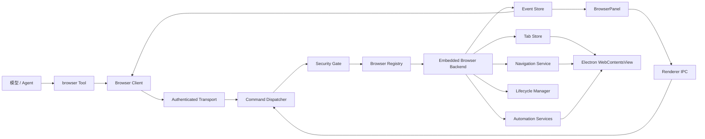

# 内置浏览器整体替换执行方案

> 历史文档：其中 Browser Protocol v2 与 `tab.playwright.*` 设计已由
> `AGENT_BROWSER_TARGET_ARCHITECTURE.md` 的 Protocol v3 direct-page 架构取代，
> 不再作为当前实现或验收依据。

## 1. 文档结论

本次改造采用一次性整体替换，不做分阶段上线，也不让新旧浏览器运行时长期并存。

最终提交必须同时完成：

- 新共享协议。
- 新 Browser Client 对象模型。
- 新 opencode `browser` Tool。
- 新 Electron Browser Runtime。
- 新标签页、导航、自动化、等待、错误、安全和事件模块。
- 新 UI 状态接线。
- 删除旧 bridge、controller、automation 和旧 action 协议。

开发过程中可以按依赖顺序编写文件，但中间状态不作为可交付版本。只有全部模块接通、旧实现删除后才算完成。

## 2. 参考边界

参考版本：OpenAI Browser Plugin `26.721.31836`。

本机插件包可以验证的内容包括：

- Browser Client 的对象层级。
- Browser、Tabs 和 Tab 的句柄关系。
- Playwright、DOM CUA、坐标 CUA、clipboard、dev 和 capabilities 的职责边界；业务内容读取见 `BROWSER_SKILL_MIGRATION_PLAN.md`。
- 标签页 claim、finalize、deliverable 和 handoff 语义。
- 命令安全检查、等待、截图、弹窗、文件选择和下载的接口语义。

插件清单标注为 Proprietary，ChatGPT 应用内的 IAB 后端不在插件包中。因此只参考可验证的模块结构和行为，不复制压缩代码，也不假设不可见后端的私有逻辑。

## 3. 替换范围

### 3.1 必须替换

- `packages/opencode/src/tool/browser.ts` 中的直接 HTTP 调用和扁平 action 分发。
- `packages/desktop-forge/src/electron/browser/bridge.ts` 中的旧 `/command` 接口。
- `packages/desktop-forge/src/electron/browser/controller.ts` 中混合的标签页、导航、错误、权限和自动化职责。
- `packages/desktop-forge/src/electron/browser/automation.ts` 中集中式自动化实现。
- `packages/desktop-forge/src/shared/browser.ts` 中仅服务旧 action 的协议定义。
- BrowserPanel 对旧全局状态字段的依赖。

### 3.2 必须保留的产品行为

- 使用 Electron `WebContentsView` 显示真实网页。
- 使用 `persist:desktop-forge-browser` partition，保留用户登录状态。
- 浏览器面板折叠后标签页不销毁。
- 地址栏和网页历史只记录真实 URL。
- 内部错误界面不能通过 `data:` URL 或其他内部 URL 进入网页历史。
- 服务器返回有内容的 404/500 页面时显示服务器页面。
- 网络失败、渲染进程崩溃或无有效响应内容时显示应用错误界面。
- 失败页面使用默认地球 favicon。
- UI 导航栏尺寸、展开收起动画和现有布局保持不回退。

### 3.3 本次不做

- 不接入 Chrome 扩展或系统 Chrome 后端。
- 不开放可修改真实页面或访问 Node/Electron 的任意 JavaScript；`evaluate` 只允许在脱离真实页面的 DOM 副本上执行受控只读表达式。
- 实现官方 Browser Plugin 明确公开的 Playwright 子集，不声称支持上游 Playwright 的完整 API。
- 不修改浏览器 partition，不迁移或清空用户 Cookie。
- 不执行打包命令，不把技能构建或客户端打包作为交付前置条件。

## 4. 整体切换原则

- 新协议直接替换旧 action 协议，不保留 `/command` 兼容端点。
- 新 Browser Runtime 直接替换 `createBrowserController`，不保留 controller adapter。
- 新 ARIA 快照直接替换旧可见 DOM 遍历，不保留静默 fallback。
- 新严格 locator 直接替换“取第一个匹配项”的宽松行为。
- Renderer IPC 和 opencode HTTP transport 共用同一个 command dispatcher 和安全门。
- 所有状态只由 Browser Runtime 产生，Tool 和 UI 不维护第二份浏览器状态。
- 所有错误都使用共享错误码，禁止不同层各自拼接不可识别的字符串错误。
- 整体切换放在同一个变更集完成；若未满足验收条件，则回退整个变更集。

## 5. 目标架构



唯一数据流：

```text
Tool 或 Renderer
→ typed command
→ transport / IPC
→ dispatcher
→ security gate
→ embedded backend
→ state + events + typed result
```

禁止：

- Tool 直接构造旧 action JSON。
- Renderer 直接操作 `WebContentsView`。
- transport 绕过 dispatcher 调用 backend。
- automation 自行修改 UI 状态。
- 页面脚本直接触发本地高风险命令。

## 6. 最终目录结构

### 6.1 新增共享协议包

```text
packages/browser-protocol/
├── package.json
├── tsconfig.json
└── src/
    ├── index.ts
    ├── browser.ts
    ├── tab.ts
    ├── commands.ts
    ├── results.ts
    ├── events.ts
    ├── errors.ts
    ├── capabilities.ts
    ├── automation.ts
    ├── files.ts
    └── validation.ts
```

包名：

```text
@opencode-ai/browser-protocol
```

这个包只包含：

- wire protocol。
- discriminated union。
- 数据结构。
- 无运行环境依赖的输入校验。
- 稳定错误码。

这个包不能依赖 Electron、Effect、SolidJS 或 Node 文件系统。

### 6.2 新增 opencode Browser Client

```text
packages/opencode/src/browser/
├── client.ts
├── transport.ts
├── browsers.ts
├── browser.ts
├── tabs.ts
├── tab.ts
├── playwright.ts
├── dom-cua.ts
├── cua.ts
├── clipboard.ts
├── dev.ts
├── capabilities.ts
└── result.ts
```

### 6.3 整体替换 desktop-forge Browser Runtime

```text
packages/desktop-forge/src/electron/browser/
├── runtime.ts
├── registry.ts
├── backend.ts
├── command-dispatcher.ts
├── transport-server.ts
├── security.ts
├── lifecycle.ts
├── event-store.ts
├── errors.ts
└── embedded/
    ├── backend.ts
    ├── tab-store.ts
    ├── tab.ts
    ├── navigation.ts
    ├── state.ts
    ├── permissions.ts
    ├── downloads.ts
    ├── dialogs.ts
    └── automation/
        ├── aria-snapshot.ts
        ├── playwright-runtime.ts
        ├── readonly-evaluate.ts
        ├── node-registry.ts
        ├── locator.ts
        ├── input.ts
        ├── waits.ts
        ├── screenshot.ts
        └── cdp.ts
```

### 6.4 删除旧文件

新实现接通后，在同一个变更集中删除：

```text
packages/desktop-forge/src/electron/browser/bridge.ts
packages/desktop-forge/src/electron/browser/controller.ts
packages/desktop-forge/src/electron/browser/automation.ts
```

`packages/desktop-forge/src/shared/browser.ts` 不再保存独立协议，只允许按 UI 需要从 `@opencode-ai/browser-protocol` 做类型导出；如果没有必要则直接删除并改为包导入。

## 7. Browser Client 对象模型

客户端结构与参考实现保持同样的职责层级：

```text
BrowserClient
└── Browsers
    └── BrowserHandle
        ├── capabilities
        └── tabs
            └── TabHandle
                ├── playwright
                ├── domCua
                ├── cua
                ├── clipboard
                ├── dev
                └── capabilities
```

建议接口：

```ts
class BrowserClient {
  readonly browsers: Browsers
  readonly documentation: Documentation
}

class Browsers {
  list(): Promise<BrowserInfo[]>
  get(browserId: string): Promise<BrowserHandle>
  getDefault(): Promise<BrowserHandle>
  getForUrl(url: string): Promise<BrowserHandle>
}

class BrowserHandle {
  readonly browserId: string
  readonly tabs: Tabs
  readonly user: BrowserUser
  readonly capabilities: CapabilityCollection

  documentation(): Promise<string>
  nameSession(name: string): Promise<void>
}

class Tabs {
  list(): Promise<TabInfo[]>
  selected(): Promise<TabHandle | undefined>
  get(tabId: string): Promise<TabHandle>
  new(): Promise<TabHandle>
  finalize(input: FinalizeTabsInput): Promise<void>
}

class TabHandle {
  readonly id: string
  readonly playwright: PlaywrightAPI
  readonly dom_cua: DomCUAAPI
  readonly cua: CUAAPI
  readonly clipboard: TabClipboardAPI
  readonly dev: TabDevAPI
  readonly capabilities: CapabilityCollection

  goto(url: string): Promise<void>
  back(): Promise<void>
  forward(): Promise<void>
  reload(): Promise<void>
  close(): Promise<void>
  screenshot(input?: ScreenshotInput): Promise<Uint8Array>
  getJsDialog(): Promise<Dialog | undefined>
  title(): Promise<string | undefined>
  url(): Promise<string | undefined>
  markDeliverable(): Promise<void>
  markHandoff(): Promise<void>
}
```

句柄只保存 `browserId`、`tabId` 和 transport，不持有 Electron 对象。
`show`、`hide`、`state`、原子等待及结构化结果方法属于当前扁平 Tool/Runtime
的内部扩展，不冒充官方 Browser Client 的公开成员。

## 8. 新 browser Tool

Tool 名称仍为 `browser`，避免模型发现入口发生无意义变化；输入协议整体替换为命名命令，不继续使用旧 action。

示例：

```json
{
  "command": "tab.goto",
  "tabId": "tab_01",
  "url": "https://example.com"
}
```

```json
{
  "command": "tab.playwright.locator.click",
  "tabId": "tab_01",
  "locator": {
    "role": "button",
    "name": "提交"
  }
}
```

Tool 只负责：

- Effect Schema 参数定义。
- 参数到 Browser Client 方法的映射。
- `ctx.ask` 权限申请。
- Tool output 和截图附件转换。
- 把 session ID、call ID 和 abort signal 交给 transport。

Tool 不负责：

- 解析 Electron 状态。
- 拼接 URL endpoint。
- 判断 Tab 是否存在。
- 执行 locator。
- 判断加载失败类型。
- 管理浏览器生命周期。

命令集合：

```text
browser.list
browser.show
browser.hide
browser.state

tabs.list
tabs.selected
tabs.new
tabs.finalize

tab.state
tab.activate
tab.goto
tab.back
tab.forward
tab.reload
tab.stop
tab.close
tab.mark
tab.screenshot

tab.playwright.domSnapshot
tab.playwright.html
tab.playwright.elementInfo
tab.playwright.elementScreenshot
tab.playwright.evaluate
tab.playwright.expectNavigation
tab.playwright.waitForURL
tab.playwright.waitForLoadState
tab.playwright.waitForTimeout
tab.playwright.locator.allTextContents
tab.playwright.locator.count
tab.playwright.locator.click
tab.playwright.locator.dblclick
tab.playwright.locator.downloadMedia
tab.playwright.locator.evaluate
tab.playwright.locator.fill
tab.playwright.locator.type
tab.playwright.locator.press
tab.playwright.locator.check
tab.playwright.locator.setChecked
tab.playwright.locator.uncheck
tab.playwright.locator.selectOption
tab.playwright.locator.innerText
tab.playwright.locator.textContent
tab.playwright.locator.getAttribute
tab.playwright.locator.isVisible
tab.playwright.locator.isEnabled
tab.playwright.locator.waitFor

tab.domCua.getVisibleDom
tab.domCua.click
tab.domCua.doubleClick
tab.domCua.downloadMedia
tab.domCua.keypress
tab.domCua.type
tab.domCua.scroll

tab.cua.click
tab.cua.doubleClick
tab.cua.drag
tab.cua.move
tab.cua.scroll
tab.cua.type
tab.cua.keypress

tab.dialog.get
tab.dialog.handle
tab.dialog.wait
tab.fileChooser.wait
tab.fileChooser.setFiles
tab.download.wait
tab.download.get

tab.clipboard.read
tab.clipboard.write
tab.dev.cdp
```

`tab.playwright.expectNavigation`、`tab.dialog.wait`、`tab.fileChooser.wait` 和
`tab.download.wait` 可携带 `trigger` locator。Runtime 必须先注册等待或启用
file chooser interception，再在同一条命令内执行点击，禁止由 Tool 拆成两个并行
HTTP 请求。

## 9. 命令协议

### 9.1 请求

```ts
interface BrowserCommandRequest {
  protocolVersion: 2
  requestId: string
  sessionId: string
  callId?: string
  browserId: string
  tabId?: string
  expectedOrigin?: string
  command: BrowserCommand
}
```

要求：

- `requestId` 每次调用唯一，用于幂等、事件关联和日志定位。
- `sessionId` 用于 Tab 所有权和资源回收。
- `expectedOrigin` 用于阻止授权后页面跳转造成的 TOCTOU。
- `browserId` 必填，即使当前只有 embedded backend。
- 所有 command 使用 discriminated union，禁止 `Record<string, unknown>` 直接下传。

### 9.2 响应

```ts
interface BrowserCommandResponse<T> {
  protocolVersion: 2
  requestId: string
  data: T
  state?: BrowserState
  events: BrowserEvent[]
}
```

### 9.3 失败

```ts
interface BrowserErrorResponse {
  protocolVersion: 2
  requestId?: string
  error: BrowserRuntimeError
}
```

HTTP 状态只表示 transport 层结果；调用者使用 `error.code` 判断浏览器错误。

### 9.4 Transport

新本地接口：

```text
POST /v1/browser/commands
```

要求：

- 只监听 `127.0.0.1`。
- 使用随机 bearer token。
- 限制 body 大小。
- 校验 content type。
- 设置命令超时和取消。
- 不返回堆栈、本地敏感路径或 Electron 内部对象。
- 删除旧 `/command`。

## 10. Browser Runtime

`runtime.ts` 是 desktop-forge 内唯一浏览器入口：

```ts
interface BrowserRuntime {
  dispatch(request: BrowserCommandRequest): Promise<BrowserCommandResponse>
  getState(browserId: string): BrowserState
  subscribe(listener: BrowserEventListener): () => void
  setLayoutBounds(bounds: BrowserBounds): void
  setSuspended(suspended: boolean): void
  destroy(): Promise<void>
}
```

Runtime 负责：

- 持有 Browser Registry。
- 接收 HTTP 和 IPC 命令。
- 调用统一 Security Gate。
- 分发到 backend。
- 汇总事件。
- 管理销毁顺序。

Runtime 不直接：

- 创建 `WebContentsView`。
- 执行 CDP。
- 解析网页内容。
- 显示权限弹窗。

## 11. Embedded Browser Backend

`embedded/backend.ts` 实现 Browser Backend 接口。

职责：

- 创建并持有 Tab Store。
- 调用 navigation、automation、dialogs、downloads 和 permissions。
- 返回统一 state。
- 处理 show/hide 和原生布局边界。
- 注册 capabilities。

当前只注册一个 backend：

```ts
{
  id: "embedded",
  kind: "embedded",
  name: "LongwiseTechAgent Browser"
}
```

Registry 从一开始就按多 backend 设计，但不实现其他 backend。

## 12. Tab Store 与生命周期

每个 Tab 保存：

```ts
interface EmbeddedTab {
  id: string
  view: WebContentsView
  generation: number
  owner: TabOwnership
  navigation: TabNavigationState
  page: TabPageState
  dialog: BrowserDialog | null
  downloads: Set<string>
}
```

所有权：

```ts
interface TabOwnership {
  createdBy: "agent" | "user"
  ownerSessionId?: string
  disposition: "temporary" | "deliverable" | "handoff"
}
```

规则：

- Agent 新建 Tab 默认为 `temporary`。
- 用户从 UI 新建 Tab 标记为 `user`。
- Agent 使用用户 Tab 时只 claim，不改变 `createdBy`。
- `deliverable` 在任务结束后保留并释放控制权。
- `handoff` 保留给同 session 的后续调用，并设置 TTL。
- finalize 关闭 Agent 的临时 Tab。
- finalize 不关闭用户 Tab。
- session 取消时终止命令、释放用户 Tab 并关闭临时 Tab。
- runtime 销毁时关闭全部 `WebContentsView`。

Tab Store 是标签页顺序、活动 Tab 和 view attach 状态的唯一真相来源。

## 13. 导航与错误页

Navigation Service 负责：

- URL 标准化，只允许 HTTP/HTTPS。
- `goto`、back、forward、reload 和 stop。
- redirect 链。
- pending、committed、failed 和 stopped 状态。
- load state 等待。
- HTTP 主文档响应元数据。
- navigation generation。

导航结果：

```ts
interface NavigationResult {
  finalUrl: string
  generation: number
  status: "committed" | "failed" | "stopped"
  error?: BrowserNavigationError
}
```

错误页判断：

- `did-fail-load`、`did-fail-provisional-load`、render process gone：显示应用错误界面。
- 主文档 HTTP 404/500 有服务器响应内容：显示服务器页面。
- 主文档返回错误状态且明确无内容：显示应用错误界面。
- redirect 中间响应不能覆盖最终页面状态。
- `ERR_ABORTED`、用户 stop 和新导航替换旧导航不显示错误页。

应用错误界面：

- 由 BrowserPanel 覆盖层渲染。
- 不调用 `webContents.loadURL(data:...)`。
- 不向 navigation history 写入内部地址。
- 地址栏仍显示失败的真实 URL。
- reload 重新加载真实 URL。
- back/forward 使用 Runtime 保存的真实 URL 逻辑历史并重新加载目标 URL，错误覆盖层不进入历史。
- favicon 强制为空，由 UI 显示默认地球图标。

## 14. ARIA 快照与节点注册

旧 visible DOM 遍历整体删除。

新快照基于 Chromium Accessibility Tree：

1. 主 frame 使用 `Accessibility.getFullAXTree`。
2. 枚举 OOPIF target 并建立独立 CDP session。
3. 合并可访问 frame，保留不可访问 frame 列表。
4. 移除纯布局节点。
5. 保留 role、accessible name、value、checked、selected、expanded、disabled 和 description。
6. 生成紧凑文本和结构化节点。
7. 为快照生成 `snapshotId`。
8. 节点记录 `backendDOMNodeId`、frame、generation 和 snapshotId。

```ts
interface BrowserDomSnapshot {
  snapshotId: string
  generation: number
  url: string
  title: string
  text: string
  nodes: BrowserDomNode[]
  inaccessibleFrames: BrowserFrameRef[]
  truncated: boolean
}
```

节点操作必须携带 `snapshotId` 和 `nodeId`。

以下情况返回 `STALE_NODE`：

- 页面发生主 frame 导航。
- frame 被替换。
- snapshot generation 与当前 generation 不一致。
- backend DOM node 已失效。

禁止自动重新匹配旧节点后继续点击。

## 15. Locator

定位优先级：

1. `testId`。
2. 稳定属性或精确 href。
3. role + accessible name。
4. label。
5. placeholder。
6. 精确文本。
7. CSS。

规则：

- 默认 strict。
- 匹配 0 个返回 `LOCATOR_NOT_FOUND`。
- 匹配多个返回 `AMBIGUOUS_LOCATOR`。
- 不自动选择第一个结果。
- 点击前校验可见、未被禁用，并滚动到可视区域。
- 操作前后检查 navigation generation。
- frame 使用稳定 frame ID，不继续使用易失效的数组索引作为主标识。

## 16. 三条交互通道

### 16.1 Playwright-like API

面向语义定位，作为默认路径：

- locator。
- snapshot。
- wait。
- element screenshot。
- 表单交互。

这里只实现受控 API，不引入完整 Playwright browser process。

### 16.2 DOM CUA

面向快照 node：

- click。
- type。
- scroll。
- focus。

所有操作绑定 snapshot 和 generation。

### 16.3 坐标 CUA

视觉兜底：

- click。
- doubleClick。
- move。
- drag。
- scroll。
- type。
- keypress。

坐标基于当前 viewport；窗口尺寸改变后旧截图坐标不再保证有效。

## 17. 等待和取消

新增：

- `waitForURL`。
- `waitForLoadState`。
- `expectNavigation`。
- `waitForDialog`。
- `waitForFileChooser`。
- `waitForDownload`。

所有等待必须支持：

- 明确 timeout。
- `AbortSignal`。
- Tab 关闭中断。
- session 取消中断。
- 新 generation 使旧页面等待失效。
- runtime destroy 中断。

加载状态：

- `domcontentloaded`。
- `load`。
- `networkidle` 保留在公开 `LoadState` 类型中，与官方 API 一致；Embedded Runtime
  按官方实现返回 `playwright_wait_for_load_state does not support networkidle`，不将其
  作为默认完成条件。

固定 sleep 不能作为主要同步手段。

## 18. 截图

截图继续使用 CDP `Page.captureScreenshot`，但实现移到独立服务。

支持：

- 当前可见区域。
- full page。
- clip。
- element。
- PNG。
- JPEG + quality。

Runtime 返回图像字节和元数据；Tool 直接转换为聊天附件，并在 JSON 输出中删除完整
base64。`savePath`、JPEG 和 quality 是扁平 Tool 的产品扩展；官方 `Tab.screenshot()`
公开参数仍只暴露 fullPage/clip，并返回 `Uint8Array`。

失败页截图同样以目标 Tab 为边界：当前可见失败页直接截取 Renderer 中的错误覆盖层；
后台或隐藏失败 Tab 使用不挂接主窗口的 offscreen `BrowserWindow` 独立渲染共享错误页，
避免把当前活动网页或主窗口其他内容混入目标 Tab 的截图。

截图失败必须区分：

- Tab 不存在。
- 页面不可用。
- clip 越界。
- element 已失效。
- CDP target 丢失。

## 19. 弹窗、文件选择与下载

### 19.1 JS Dialog

通过常驻 debugger 监听 `Page.javascriptDialogOpening` 和
`Page.javascriptDialogClosed`，保存：

- dialog ID。
- 类型。
- message。
- default prompt。
- Tab ID。
- generation。

处理操作：

- accept。
- dismiss。
- prompt 输入。

页面存在阻塞 dialog 时，不允许执行会被 dialog 阻塞的命令，返回 `DIALOG_REQUIRED`。

### 19.2 文件选择

流程：

```text
waitForFileChooser
→ 点击上传控件
→ chooser.setFiles
```

校验：

- 路径为绝对路径。
- 文件存在。
- Tool 已取得 read/upload 权限。
- multiple 与 input 能力一致。
- chooser 属于当前 Tab 和 generation。

### 19.3 下载

Download Store 状态：

```text
pending
in-progress
completed
cancelled
failed
```

每个下载记录：

- download ID。
- Tab ID。
- session ID。
- URL。
- 文件名。
- received bytes。
- total bytes。
- 最终路径或附件引用。
- 错误。

`tab.download.wait` 可返回刚创建的当前 session 下载记录；只有完成且属于当前
session 的下载记录才允许返回最终本地路径。

## 20. Capability

浏览器级：

- `visibility`。

Tab 级：

- `cdp`。

Dialog、下载和文件选择是官方 `Tab`/`PlaywrightAPI` 的核心公开 API，不作为 capability
重复注册。

预留但本次不实现：

- `webMCP`。
- `browserAuth`。
- `botDetection`。
- `pageAssets`。

不可用 capability 在调用前返回 `CAPABILITY_UNAVAILABLE`，不能返回调用后才失败的空对象。

## 21. 安全模型

### 21.1 Tool 层

- 导航按目标 URL 申请 `webfetch`。
- 页面交互按当前 origin 申请 `browser_interaction`。
- 文件上传申请文件 read 权限。
- CDP 申请 `browser_cdp`。
- 有外部副作用的提交在动作发生时确认。
- `browser_interaction` 与 `browser_cdp` 的内置默认策略均为 `ask`，不能被全局 `* = allow` 静默放行。

### 21.2 Runtime 层

每条 HTTP 和 IPC 命令都经过同一个 `SecurityGate.ensureAllowed`：

- 校验 token、protocolVersion、requestId 和 schema。
- 校验 browser 和 Tab 存在。
- 校验 session 是否拥有或已 claim Tab。
- 校验 `expectedOrigin` 与当前 origin。
- 校验命令是否允许在空 Tab、错误页或阻塞 dialog 状态执行。
- 校验文件路径。
- 校验 CDP method allowlist。
- 校验 body、字符串、数组和截图尺寸限制。
- 拒绝网页内容诱导执行本地高风险命令。

安全门在 backend 调用前再次读取当前 Tab 状态，不能信任 Tool 在权限申请前读取的旧状态。

## 22. CDP 限制

允许：

- 页面读取和调试所需的只读 domain。
- 截图、Accessibility、DOM、Runtime 的受控方法。
- OOPIF target 管理所需方法。

禁止：

- 任意文件系统访问。
- 下载到未经授权路径。
- 修改浏览器全局代理。
- 访问其他 session 的 target。
- 连接非当前 Tab 派生 target。
- 未列入 allowlist 的危险 Browser domain 命令。

`tab.dev.cdp` 必须绑定：

- approved origin。
- Tab ID。
- target ID。
- session ID。
- request ID。

## 23. 错误模型

```ts
interface BrowserRuntimeError {
  code:
    | "BROWSER_UNAVAILABLE"
    | "BROWSER_NOT_FOUND"
    | "TAB_NOT_FOUND"
    | "TAB_CLOSED"
    | "TAB_NOT_OWNED"
    | "STALE_NODE"
    | "STALE_FRAME"
    | "AMBIGUOUS_LOCATOR"
    | "LOCATOR_NOT_FOUND"
    | "ELEMENT_NOT_ACTIONABLE"
    | "NAVIGATION_FAILED"
    | "NAVIGATION_REPLACED"
    | "ORIGIN_CHANGED"
    | "CAPABILITY_UNAVAILABLE"
    | "PERMISSION_DENIED"
    | "DIALOG_REQUIRED"
    | "FILE_CHOOSER_NOT_FOUND"
    | "DOWNLOAD_NOT_FOUND"
    | "TARGET_GONE"
    | "TIMEOUT"
    | "CANCELLED"
    | "INVALID_COMMAND"
  message: string
  retryable: boolean
  details?: Record<string, unknown>
}
```

错误转换只在 `errors.ts` 维护一次。Tool、transport、backend 和 UI 都消费同一错误结构。

## 24. 事件与状态

事件：

- browser shown/hidden。
- Tab created/activated/updated/closed。
- navigation started/committed/completed/failed。
- URL/title/favicon/loading changed。
- dialog opened/closed。
- file chooser opened/closed。
- download created/updated/completed/failed。
- render process gone。
- permission requested/resolved。

每个事件包含：

- event ID。
- timestamp。
- browser ID。
- Tab ID。
- request ID。
- session ID。
- generation。

BrowserState：

```ts
interface BrowserState {
  browserId: string
  visible: boolean
  activeTabId: string | null
  viewport: BrowserBounds
  tabs: BrowserTabState[]
}
```

BrowserTabState：

- id。
- url。
- title。
- favicon。
- loading。
- canGoBack。
- canGoForward。
- error。
- ownership。
- generation。
- dialog。
- download count。

## 25. UI 接线

BrowserPanel 只做：

- 渲染 runtime state。
- 发送 typed IPC command。
- 输入 URL。
- 切换、创建、关闭 Tab。
- 前进、后退、刷新、停止。
- 显示错误覆盖层。
- 展示下载和权限交互。

BrowserPanel 不做：

- 自己维护网页历史。
- 自己下载 favicon。
- 自己推断页面是否失败。
- 自己生成内部错误 URL。
- 自己执行 CDP 或页面脚本。

需要同步修改：

```text
packages/desktop-forge/src/electron/app/state.ts
packages/desktop-forge/src/electron/ipc/index.ts
packages/desktop-forge/src/electron/server/opencode-server.ts
packages/desktop-forge/src/electron/window/create-window.ts
packages/desktop-forge/src/main.ts
packages/desktop-forge/src/preload.ts
packages/desktop-forge/src/renderer/components/App.tsx
packages/desktop-forge/src/renderer/components/BrowserPanel.tsx
```

## 26. 文件级执行清单

### 26.1 Workspace

- 新增 `packages/browser-protocol`。
- 在 `packages/opencode/package.json` 添加 workspace dependency。
- 在 `packages/desktop-forge/package.json` 添加 workspace dependency。
- 更新 workspace lockfile，但不运行打包命令。

### 26.2 Protocol

- 定义 Browser、Tab、ownership、state 和 bounds。
- 定义全部 command input。
- 定义 command request/response envelope。
- 定义 events。
- 定义 errors。
- 定义 screenshot、snapshot、dialog、file chooser 和 download。
- 定义 capability map。
- 定义无运行时依赖的校验器。

### 26.3 opencode

- 新建 Browser Client 全部模块。
- 新建 authenticated transport。
- 启动时消费并清除 desktop transport 环境凭据。
- 将 abort、session ID 和 call ID 贯穿到 request。
- 重写 `tool/browser.ts` 参数和命令分发。
- 保留工具权限逻辑，但改为调用前读取新 Tab state。
- 截图结果转换为附件。
- 更新工具描述，明确 semantic-first 和坐标兜底。
- 更新 tool registry 引用。
- 在 config/permission 和 agent 默认规则中登记 `browser_interaction`、`browser_cdp`。

### 26.4 desktop-forge Runtime

- 新建 runtime、registry、dispatcher、security、event store 和 lifecycle。
- 新建 HTTP transport server。
- 新建 embedded backend。
- 新建 Tab Store。
- 新建 navigation。
- 新建 ARIA snapshot 和 node registry。
- 新建 locator、input、wait、screenshot 和 CDP。
- 新建 dialogs、file chooser 和 downloads。
- 将网站 permission 迁入 permissions 模块。
- 将 bounds 和 view attach 迁入 backend/state。

### 26.5 App wiring

- MainState 从 BrowserController 改为 BrowserRuntime。
- create-window 创建 Runtime 并注册 embedded backend。
- opencode server 注入新 transport URL 和 token。
- IPC 调用 Runtime dispatcher。
- preload 暴露新 typed command 和 state。
- Renderer 改为新 BrowserState。
- 应用退出时按 lifecycle 顺序 destroy。

### 26.6 删除

- 删除旧 `/command`。
- 删除旧 action validation。
- 删除旧 controller。
- 删除旧 automation。
- 删除旧 visible DOM snapshot。
- 删除旧 BrowserCommand union。
- 删除旧错误字符串分支。
- 删除所有只服务旧实现的导入和死代码。

## 27. 单次变更内的编码顺序

以下顺序只表示代码依赖，不表示分阶段交付：

1. 建立共享 protocol，使所有后续模块使用同一类型。
2. 写 Browser Client 和 transport。
3. 写 Runtime 接口、registry、dispatcher、security 和 event store。
4. 写 Embedded Backend、Tab Store 和 navigation。
5. 写 ARIA snapshot、node registry、locator、CUA、wait、screenshot 和 CDP。
6. 写 dialogs、file chooser、downloads、permissions 和 lifecycle。
7. 重写 browser Tool。
8. 重写 IPC、preload、MainState 和 window 接线。
9. 重写 BrowserPanel 状态消费。
10. 删除全部旧实现。
11. 全仓搜索旧类型、旧 endpoint 和旧 action，确保引用为零。

任何一个步骤未完成时都不切换为最终版本。

## 28. 验收矩阵

### 28.1 架构

- opencode 与 desktop-forge 只通过 protocol 通信。
- Tool 不直接调用旧 endpoint。
- HTTP 和 IPC 共用 dispatcher 与 Security Gate。
- Runtime 内没有旧 controller。
- 旧 action、旧 endpoint 和旧 DOM snapshot 引用为零。

### 28.2 标签页

- 新建两个 Tab 后分别保持 URL、标题、favicon 和历史。
- 切换 Tab 不重新加载。
- 关闭活动 Tab 后选择相邻 Tab。
- 用户 Tab 不被 finalize 误关。
- Agent 临时 Tab 在 finalize 后关闭。
- deliverable 保留。
- handoff 只允许原 session 在 TTL 内继续。

### 28.3 导航

- 成功导航返回最终 URL。
- redirect 后 origin 使用最终页面。
- back、forward、reload 和 stop 行为正确。
- 新导航替换旧导航不会显示错误页。
- Tab 关闭会中断导航等待。

### 28.4 错误页面

- 有内容的服务器 404/500 正常显示。
- DNS、连接、TLS、空响应失败显示应用错误界面。
- render process 崩溃显示应用错误界面。
- 错误界面不进入 WebContents history。
- 地址栏保持真实失败 URL。
- 从错误页输入新 URL 后，back 返回真实失败 URL。
- 失败页面 favicon 为默认地球图标。

### 28.5 DOM 与定位

- 快照包含 role、name、value、checked、selected、expanded、disabled 和 frame。
- 主 frame 和 OOPIF 行为可预测。
- 多匹配返回 `AMBIGUOUS_LOCATOR`。
- 零匹配返回 `LOCATOR_NOT_FOUND`。
- 导航后旧节点返回 `STALE_NODE`。
- 隐藏或禁用元素不会被静默点击。

### 28.6 交互

- click、doubleClick、fill、type、press、check、uncheck、selectOption 可用。
- DOM CUA 绑定 snapshot。
- 坐标 CUA 使用当前 viewport。
- 需要导航的点击可与 `expectNavigation` 同步。
- 有副作用动作经过当前 origin 安全检查。

### 28.7 文件与媒体

- 当前可见区域、full page、clip 和 element screenshot 正确。
- 单文件、多文件上传校验正确。
- Dialog 可接受、拒绝和输入 prompt。
- 下载成功、取消、失败均有状态。
- 非当前 session 不能读取下载结果。

### 28.8 稳定性

- 单个 Tab 崩溃不导致 Runtime 崩溃。
- Tab 关闭中止该 Tab 的全部等待。
- session 取消中止当前命令。
- Runtime destroy 不遗留 WebContentsView 或 debugger session。
- 后端重建后旧句柄返回明确错误。

## 29. 静态检查与用户验收边界

实现者负责：

- 协议类型一致性。
- package 内 typecheck。
- lint 或等价静态检查。
- 搜索旧 endpoint、旧 action 和旧 controller 引用。
- 不运行打包命令。

除静态检查外，使用开发态 LongwiseTechAgent 客户端做关键路径回归；不执行 Electron
打包。仍由用户决定是否继续进行完整人工验收。

## 30. 完成定义

同时满足以下条件才算整体替换完成：

- 新目录和所有模块已实现并接线。
- 新 Tool 使用 Browser Client。
- 新 transport 使用 typed protocol。
- HTTP 和 IPC 通过统一 dispatcher。
- Security Gate 覆盖全部命令。
- ARIA snapshot、strict locator、wait、dialog、file chooser、download 和 lifecycle 均已实现。
- UI 完全消费新 state。
- 旧 controller、bridge、automation 和 action protocol 已删除。
- 旧符号和 endpoint 全仓引用为零。
- 静态检查无新增错误。
- 文档与最终代码一致。

只完成 Browser Client、只拆 controller 或只增加新 endpoint，都不算完成。

## 31. 回退方案

不在运行时保留双实现，也不增加 feature flag。

若整体替换未通过验收：

- 回退整个浏览器替换提交。
- 不单独恢复旧 controller 的部分代码。
- 不让新 Tool 调用旧 bridge。
- 不复用新旧两套 state。

回退后用户的浏览器 partition 不变，因此 Cookie 和登录状态不会因为代码回退而丢失。

## 32. 最终交付物

- `@opencode-ai/browser-protocol`。
- 完整 Browser Client。
- 重写后的 `browser` Tool。
- 完整 Browser Runtime。
- Embedded Browser Backend。
- 新 BrowserPanel 接线。
- 已删除的旧实现清单。
- 静态检查结果。
- 用户客户端验收清单。
- 与代码一致的本执行方案。

## 33. 当前实现状态

代码整体替换已完成：

- 已新增 `@opencode-ai/browser-protocol`。
- 已新增完整 Browser Client。
- 已将 `browser` Tool 替换为命名命令协议。
- 已接入统一 Runtime、dispatcher、Security Gate、HTTP transport 和 IPC。
- 已实现 Embedded Backend、逻辑历史、错误覆盖层状态、ARIA 快照、strict locator、DOM CUA、坐标 CUA、wait、截图资源、Dialog、文件选择和下载。
- 已接入标签页 ownership、finalize、handoff TTL 和取消回收。
- 已接入 generation 导航替换保护，旧导航失败不会覆盖新页面。
- 已将导航、Dialog、文件选择和下载的“等待 + 点击”合并为 Runtime 原子命令。
- 空白 `WebContentsView` 不再阻塞等待 CDP 初始化：导航先启动，`Network/Page` domain 在 `did-start-loading` 后启用；无选中标签的 Tool `tab.goto` 会自动创建临时标签。
- `LoadState` 与官方一样保留 `networkidle`，Embedded Runtime 与官方实现一样明确拒绝
  该状态；常规 `goto` 不追加 `waitForLoadState`。
- favicon 由 Embedded Backend 通过浏览器持久 Session 获取并转成受大小限制的 `data:image/*`，不让主界面另起无 Cookie 请求；加载失败页清空站点图标并回退到默认地球图标。
- 已补齐 Runtime 重建时的 permission、webRequest、download 和 debugger 资源释放。
- opencode 启动时读取 transport URL/token 后立即从 `process.env` 删除，Bash 子进程不继承浏览器凭据。
- 已删除旧 `bridge.ts`、`controller.ts` 和集中式 `automation.ts`。
- 已确认旧 endpoint 和旧 action 协议在运行代码中引用为零。
- 已按官方 `docs/api.json` 机械核对 22 个公开接口，公开成员缺失数为 0。
- 已在真实客户端验证：失败页显示、失败页直接截图附件、后台失败 Tab 独立截图、
  成功导航、返回真实失败 URL、关闭标签和 debugger 清理。

已通过：

```text
packages/browser-protocol: bun typecheck
packages/desktop-forge: bun typecheck
packages/opencode: bun typecheck
git diff --check
```

按照约定未执行：

- Electron 打包。
- 技能构建。

完整交互矩阵仍可由用户按第 28 节继续验收。
